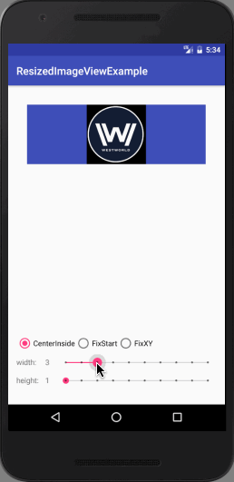

# ResizedImageView

The library is for creating the specific aspect ratio `ImageView`.



## Usage

The library is just lke the original `ImageView` except adding two more properties, `aspectRatioWidth` and `aspectRatioHeight`.

You can set them in layout file like this:

```
<com.inaction.share.resizedimageview.ResizedImageView
    android:id="@+id/resizedImageView"
    android:layout_width="wrap_content"
    android:layout_height="wrap_content"
    app:aspectRatioWidth="1"
    app:aspectRatioHeight="1"
    android:src="@drawable/westworld"
    android:scaleType="centerInside"
    android:background="@color/colorPrimary"
    android:layout_centerHorizontal="true"
    />
```

Or change them later in your code like this:

```
resizedImageView.setAspectRatio(4, 3);
```


You may need to get the them in your code, check this:

```
int aspectRatioWidth = resizedImageView.getAspectRatioWidth();
int aspectRatioWidth = resizedImageView.getAspectRatioHeight();
```

## Import

You can add the library to your project's dependencies list by adding the code below into `build.gradle`:

`compile 'ResizedImageView:resizedimageview:1.0.0'`

Or just clone the repo then add the library directory to your project as a module.
